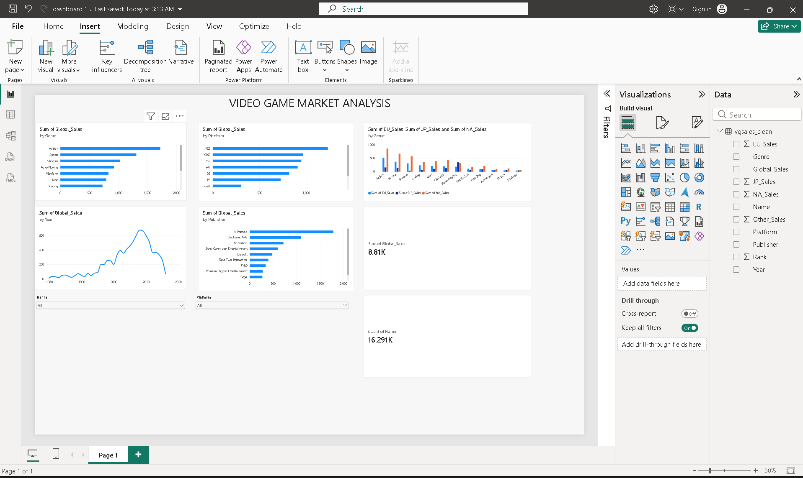

# Video Game Market Analysis

## Problem Statement
A new game studio wants to know which genres, platforms, and regions
to focus on, based on historical video game sales.

## Dashboard

## Key Insights
- Action, Sports and Shooter are the top genres by global sales.
- Shooter and Platform games earn the most per game.
- Sony, Microsoft and Nintendo platforms dominate; PS2 is first.
- Nintendo leads publishers with about 2.6M units per game.
- Japan prefers Role-Playing (27% of sales); North America and Europe prefer Action, Sports and Shooter.
- Sales peaked around 2008-2009. The dataset ends around 2016.

## Dataset
Video Game Sales (Kaggle): paste your dataset link here

## Tools
Python (Pandas, Matplotlib, Seaborn), SQL (SQLite), Power BI

## Files
- `analysis_clean.ipynb`: cleaning, analysis, SQL
- `dashboard.pbix`: Power BI dashboard
- `vgsales_clean.csv`: cleaned data

## Author
Amar Gautam
